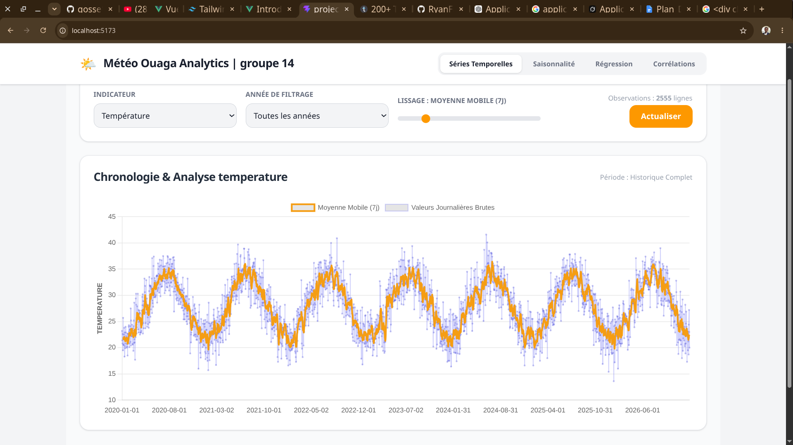
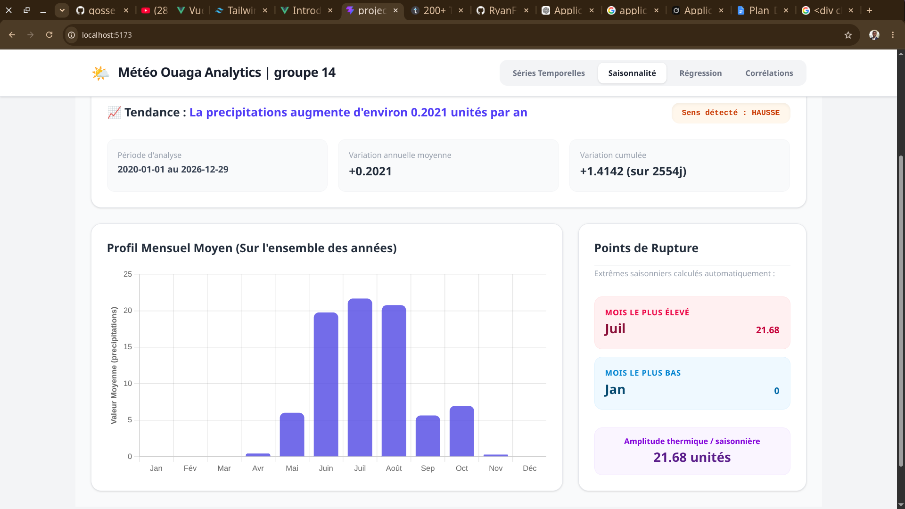
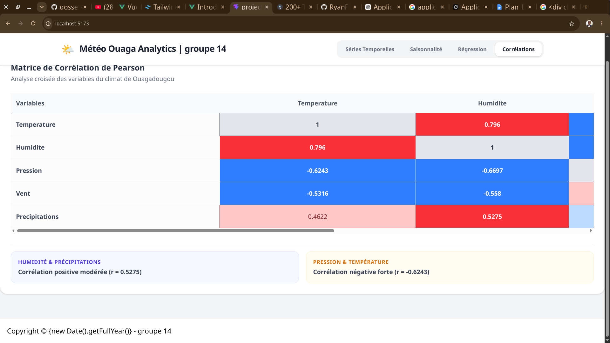
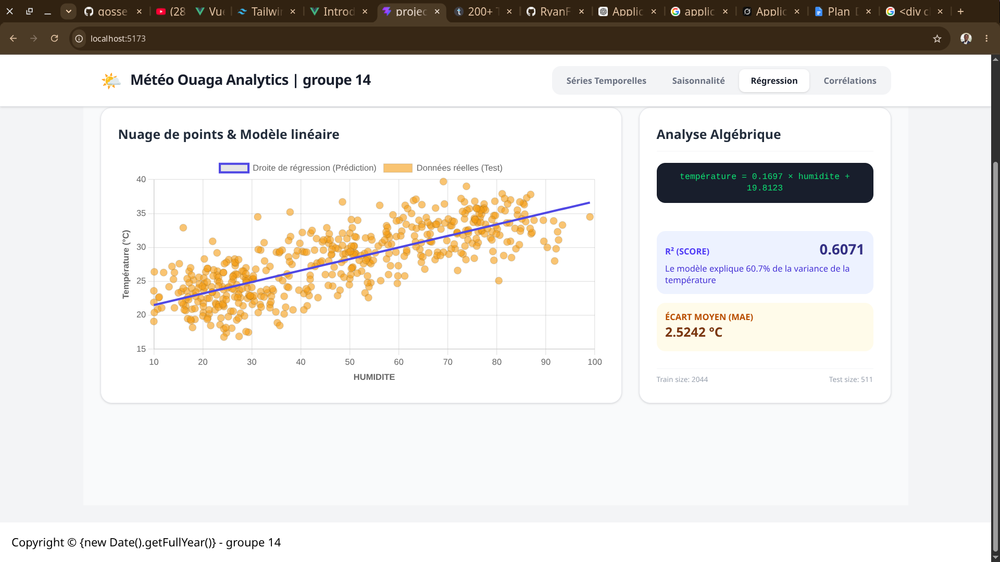

<div align="center">

# 🌤️ Application des Mathématiques à la Prévision Météorologique

**Projet tutoré universitaire — Démonstration interactive de l'usage des mathématiques dans l'analyse et la prédiction météorologique**

[](https://www.python.org/)
[](https://fastapi.tiangolo.com/)
[](https://vuejs.org/)
[](https://tailwindcss.com/)
[](https://scikit-learn.org/)
[](./LICENSE.md)
[]()

---

*Une application web fullstack qui explore comment les mathématiques — séries temporelles, régression linéaire, corrélation de Pearson — permettent d'analyser et de prédire le climat de Ouagadougou, Burkina Faso.*

</div>

---

## 📸 Aperçu de l'application

> *Les captures d'écran ci-dessous illustrent les différents modules interactifs de l'application.*


Module 
# 📈 **Séries temporelles** : Visualisation des données brutes avec moyenne mobile ajustable 


# 📉 **Tendance & Saisonnalité** : Analyse de la tendance linéaire et des cycles mensuels 


 
# 🔗 **Corrélation** : Matrice de corrélation de Pearson entre les variables météo 



# 🤖 **Régression & Prédiction** : Modèle de régression multiple avec formulaire de prédiction 


---

## 🎯 Objectif du projet

Ce projet tutoré a pour but de **rendre les mathématiques tangibles et accessibles** à travers une application interactive. Il démontre que des concepts comme la régression linéaire, la moyenne mobile ou le coefficient de Pearson ne sont pas que des abstractions théoriques — ce sont des outils qui permettent de comprendre et d'anticiper les phénomènes réels.

Le cas d'usage choisi est la **météorologie à Ouagadougou** (Burkina Faso), ville à climat tropical avec des variations saisonnières bien marquées, ce qui en fait un terrain d'étude idéal pour illustrer les concepts de saisonnalité et de tendance.

> 💡 **Note pédagogique** : Les données utilisées sont synthétiques mais réalistes. Elles ont été générées en Python pour représenter le comportement climatique de Ouagadougou. Elles sont exclusivement destinées à un usage éducatif.

---

## ✨ Fonctionnalités

### 📊 Analyse des données météorologiques

- **Sélection de variables** : température, humidité, pression atmosphérique, vitesse du vent
- **Filtrage temporel** : sélection par année
- **Visualisations interactives** : graphiques Plotly intégrés dans le frontend Vue.js

### 📈 Séries temporelles

- Affichage des données réelles sur une période choisie
- Calcul et affichage de la **moyenne mobile** avec fenêtre ajustable
- Explication mathématique inline de la formule

### 📉 Tendance linéaire & Saisonnalité

- Calcul de la **droite de tendance** par régression linéaire
- Affichage de la **pente** (coefficient directeur) et son interprétation
- Statistiques mensuelles : moyenne, min, max, écart-type
- Visualisation des cycles saisonniers

### 🔗 Corrélation de Pearson

- Matrice de corrélation complète entre toutes les variables météo
- Codage couleur pour identifier les corrélations positives et négatives
- Interprétation automatique du coefficient r

### 🤖 Régression linéaire simple et multiple

- **Régression simple** : Température = a × variable + b
- **Régression multiple** : Température = a₁ × humidité + a₂ × pression + a₃ × vent + b
- Affichage de la droite de régression et des métriques (MAE, MSE, R²)

### 🔮 Prédiction

- Formulaire interactif : l'utilisateur saisit humidité, pression, vent
- Le backend entraîne automatiquement le modèle et retourne :
  - La température prédite
  - L'équation complète du modèle
  - Les coefficients a₁, a₂, a₃ et b
  - Les métriques de performance

---

## 🛠️ Technologies utilisées

### Backend

| Technologie | Rôle |
|-------------|------|
| **Python 3.10+** | Langage principal du backend |
| **FastAPI** | Framework web asynchrone, API REST |
| **Pandas** | Manipulation et analyse des données |
| **NumPy** | Calculs matriciels et numériques |
| **Scikit-Learn** | Modèles de machine learning (régression, métriques) |
| **Matplotlib** | Génération de graphiques statiques |
| **Plotly** | Graphiques interactifs envoyés au frontend |

### Frontend

| Technologie | Rôle |
|-------------|------|
| **Vue.js 3** | Framework JavaScript réactif |
| **Tailwind CSS** | Stylisation utilitaire |
| **Vite** | Bundler et serveur de développement |

### Données

| Élément | Détail |
|---------|--------|
| **Format** | CSV (`meteo_ouaga.csv`) |
| **Contenu** | Température, humidité, pression, vent |
| **Origine** | Données synthétiques générées en Python |
| **Représentation** | Climat de Ouagadougou, Burkina Faso |
| **Usage** | Exclusivement pédagogique |

---

## 🚀 Installation rapide

# 01 — Installation et mise en route

Installer et exécuter le projet **Application des Mathématiques à la Prévision Météorologique** sur un environnement local.

---

## 🧰 Prérequis techniques

Avant de commencer, assure-toi d’avoir installé :

### 🔹 Système
- Linux / Windows / macOS

### 🔹 Outils requis

| Outil | Version recommandée | Rôle |
|------|---------------------|------|
| Python | ≥ 3.10 | Backend FastAPI |
| Node.js | ≥ 18 | Frontend Vue.js |
| npm | ≥ 8 | Gestion des dépendances JS |
| Git | latest | Clonage du projet |

---

## 📦 1. Clonage du projet

```bash id="clone-repo"
git clone https://github.com/username/weather-math-project.git
cd weather-math-project
### Prérequis

- Python 3.10 ou supérieur
- Node.js 18 ou supérieur
- npm ou yarn

### 1. Cloner le dépôt

```bash
git clone https://github.com/votre-utilisateur/meteo-maths.git
cd meteo-maths
```

### 2. Lancer le backend

```bash
cd backend
python -m venv venv
source venv/bin/activate       # Linux/macOS
# venv\Scripts\activate        # Windows
pip install -r requirements.txt
uvicorn app.main:app --reload
```

Le backend est accessible sur : `http://localhost:8000`  
La documentation interactive FastAPI est sur : `http://localhost:8000/docs`

### 3. Lancer le frontend

```bash
cd frontend
npm install
npm run dev
```

Le frontend est accessible sur : `http://localhost:5173`

---

## 📁 Structure du projet

```
meteo-maths/
│
├── backend/
│   ├── app/
│   │   ├── main.py                     # Point d'entrée FastAPI
│   │   └── routes/
│   │       ├── meteo.py                # Router /meteo — données brutes
│   │       ├── analyse.py              # Router /analyse — corrélation, régression
│   │       └── series.py              # Router /series — séries temporelles
│   └── requirements.txt
│
├── frontend/
│   ├── src/
│   │   ├── components/
│   │   │   ├── EvolutionTemporelle.vue      # Séries temporelles
│   │   │   ├── SaisonnaliteEtTendance.vue   # Tendance + saisonnalité
│   │   │   ├── AnalyseRegression.vue        # Régression simple et multiple
│   │   │   ├── MatriceCorrelation.vue       # Corrélation de Pearson
│   │   │   └── FormulairePrediction.vue     # Formulaire de prédiction
|   |   |   |__ Apropos.vue                  # pour expliquer le site
│   │   └── App.vue
│   ├── package.json
│   └── vite.config.js
│
├── dataset/
│   └── meteo_ouaga.csv  
|   |__generet_data.py                # Données météo synthétiques
│
│
├── README.md
├── LICENSE.md

```


## 🧮 Concepts mathématiques abordés

Ce projet couvre les notions suivantes, toutes appliquées à des données concrètes :

- **Moyenne mobile** — lissage de séries temporelles bruyantes
- **Régression linéaire simple** — droite de meilleur ajustement par moindres carrés
- **Régression linéaire multiple** — plan hyperplan dans un espace multidimensionnel
- **Corrélation de Pearson** — mesure de la dépendance linéaire entre deux variables
- **Saisonnalité** — analyse des cycles périodiques dans les données
- **Métriques de performance** — MAE, MSE, R² pour évaluer un modèle prédictif

---


## 📜 Licence

Ce projet est distribué sous licence MIT. Voir [LICENSE](./LICENSE) pour les détails.

---

## 👨‍💻 Auteur : Goupe 14

Projet réalisé dans le cadre d'un projet tutoré universitaire.

---

<div align="center">

*Fait avec ❤️ à Ouagadougou, Burkina Faso*

</div>